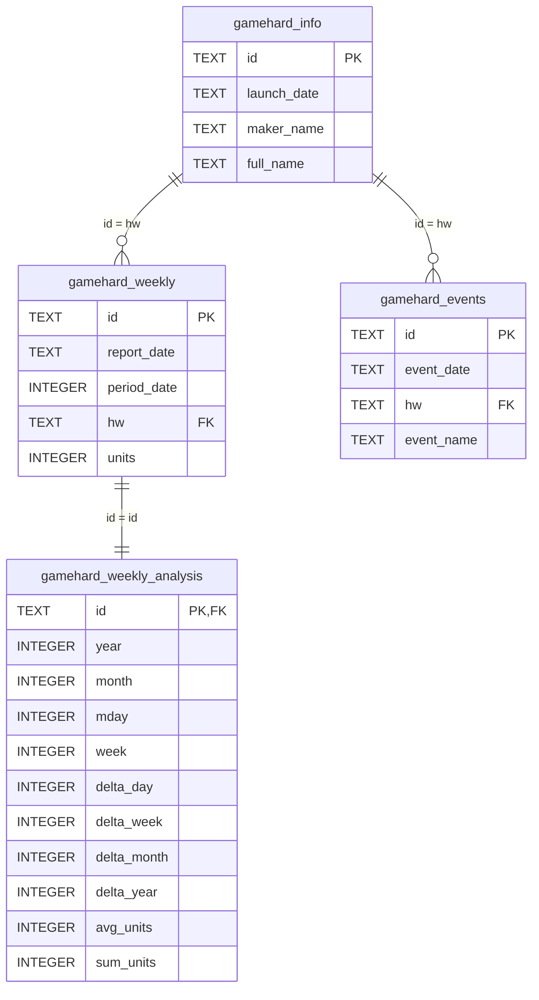

# データベース設計概要

このリポジトリのデータベースは、ゲームハードの情報・週次販売データ・関連イベント情報を管理するためのSQLite3用スキーマです。  
本READMEでは、`create_tables.sql` で定義されているテーブル構造とその設計意図について説明します。

---

## テーブル一覧

### 1. `gamehard_info`

ゲームハード（コンソール）の基本情報を管理します。

| カラム名      | 型    | 制約・説明                                                                 |
|:------------- |:----- |:-------------------------------------------------------------------------- |
| id            | TEXT  | PRIMARY KEY。ゲームハードの識別子（例: "NSW", "PS5" など）                |
| launch_date   | TEXT  | NOT NULL。発売日（YYYY-MM-DD形式）。形式チェックあり                       |
| maker_name    | TEXT  | NOT NULL。メーカー名（例: "Nintendo", "Sony" など）                        |
| full_name     | TEXT  | NOT NULL。ゲームハードの正式名称（例: "Nintendo Switch", "PlayStation 5" など）          |

- `id` は他テーブルの外部キーとして参照されます。
- `launch_date` には `GLOB '????-??-??'` による形式チェックが入っています（数字であることや実在日付までは保証しません）。

---

### 2. `gamehard_weekly`

ゲームハードごとの週次販売データを管理します。

| カラム名      | 型    | 制約・説明                                                                 |
|:------------- |:----- |:-------------------------------------------------------------------------- |
| id            | TEXT  | PRIMARY KEY。`report_date` と `hw` を連結した文字列（例: "2023-10-01_NSW"）|
| report_date   | TEXT  | NOT NULL。集計期間の末日（YYYY-MM-DD形式）。形式チェックあり                |
| period_date   | INTEGER| NOT NULL。集計日数（通常7、時々14など）                                   |
| hw            | TEXT  | NOT NULL。ゲームハードの識別子。`gamehard_info(id)` への外部キー           |
| units         | INTEGER| NOT NULL。売上台数（0以上）。                                             |

- `hw` は `gamehard_info(id)` を参照する外部キーです（ON DELETE CASCADE）。
- `report_date` には `GLOB '????-??-??'` による形式チェックがあります。
- `units` は0以上の整数のみ許可されます。

---

### 3. `gamehard_events`

ゲームハードに関連するイベント情報を管理します。

| カラム名      | 型    | 制約・説明                                                                 |
|:------------- |:----- |:-------------------------------------------------------------------------- |
| id            | TEXT  | PRIMARY KEY。`event_date` と `hw` を連結した文字列（例: "2025-06-05_NS2"） |
| event_date    | TEXT  | NOT NULL。イベント日（YYYY-MM-DD形式）。形式チェックあり                   |
| hw            | TEXT  | NOT NULL。ゲームハードの識別子。`gamehard_info(id)` への外部キー           |
| event_name    | TEXT  | NOT NULL。イベント名（例: "PS5値下げセール開始" など）                     |

- `hw` は `gamehard_info(id)` を参照する外部キーです（ON DELETE CASCADE）。
- `event_date` には `GLOB '????-??-??'` による形式チェックがあります。

---

### 4. `gamehard_weekly_analysis`

週次販売データとゲームハード情報をもとに、分析用の指標をまとめたテーブルです。

| カラム名      | 型      | 制約・説明                                                                                  |
|:------------- |:------- |:------------------------------------------------------------------------------------------ |
| id            | TEXT    | PRIMARY KEY。`gamehard_weekly(id)` と同じ値。外部キーでもある                              |
| year          | INTEGER | `report_date` の年                                                                         |
| month         | INTEGER | `report_date` の月                                                                         |
| mday          | INTEGER | `report_date` の日                                                                         |
| week          | INTEGER | `report_date` の週番号（ISO週番号）                                                        |
| delta_day     | INTEGER | 発売日から何日後か（発売日と同じなら0）                                                    |
| delta_week    | INTEGER | 発売日から何週間後か（発売週と同じなら0）                                                  |
| delta_month   | INTEGER | 発売日から何ヶ月後か（発売月と同じなら0）                                                  |
| delta_year    | INTEGER | 発売年から何年後か（発売年と同じなら0、翌年なら1、整数）                                   |
| avg_units     | INTEGER | 1日あたりの販売台数。`units` の値を `period_date`の値で割ったもの。整数、小数点以下切り捨て   |
| sum_units     | INTEGER | `report_date` 時点でのそのゲーム機の累計台数（その週の `units` も加算済み）                |

- `id` は `gamehard_weekly(id)` を参照する外部キーです（ON DELETE CASCADE）。
- このテーブルは、`gamehard_weekly` と `gamehard_info` のデータをもとに、分析や可視化に便利な形で指標をまとめています。
- `sum_units` は各ハードごとに `report_date` 昇順で累積計算されます。

---

## インデックス

- `gamehard_weekly(report_date)` に `idx_gamehard_weekly_report_date`
- `gamehard_weekly(hw)` に `idx_gamehard_weekly_hw`

これにより、週次データの検索効率が向上します。

---
## ビュー `hard_sales`

`hard_sales` は、ゲームハードの週次販売データ・分析指標・ハード情報を統合して参照できるビューです。  
主に分析や可視化、データ抽出用途で利用します。

#### カラム一覧

| カラム名      | 型      | 説明                                   | 元のテーブル.カラム         |
|:------------- |:------- |:-------------------------------------|:----------------------- |
| weekly_id     | TEXT    | 週次データのID（gamehard_weekly.id）    |  gamehard_weekly.id      |
| begin_date    | TEXT    | 集計開始日（週の初日）   |  gamehard_weekly_analysis.begin_date                    |
| end_date      | TEXT    | 集計終了日（週の末日、=report_date）  |  gamehard_weekly.report_date  |
| report_date   | TEXT    | 集計期間の末日                  | gamehard_weekly.report_date |
| period_date   | INTEGER | 集計日数                       | gamehard_weekly.period_date  |
| hw            | TEXT    | ゲームハードの識別子              | gamehard_weekly.hw    |
| units         | INTEGER | 週次販売台数                      | gamehard_weekly.units |
| year          | INTEGER | report_dateの年                 |  gamehard_weekly_analysis.year  |
| month         | INTEGER | report_dateの月                 |  gamehard_weekly_analysis.month |
| mday          | INTEGER | report_dateの日                 |  gamehard_weekly_analysis.mday  |
| week          | INTEGER | report_dateの週番号（ISO週番号）  |  gamehard_weekly_analysis.week |
| delta_day     | INTEGER | 発売日から何日後か                |  gamehard_weekly_analysis.delta_day|
| delta_week    | INTEGER | 発売日から何週間後か              |  gamehard_weekly_analysis.delta_week|
| delta_month   | INTEGER | 発売日から何ヶ月後か.            |  gamehard_weekly_analysis.delta_month|
| delta_year    | INTEGER | 発売年から何年後か                |  gamehard_weekly_analysis.delta_year |
| avg_units     | INTEGER | 1日あたりの販売台数               | gamehard_weekly_analysis.avg_units |
| sum_units     | INTEGER | report_date時点での累計販売台数   | gamehard_weekly_analysis.sum_units |
| launch_date   | TEXT    | 発売日                         |  gamehard_info.launch_date |
| maker_name    | TEXT    | メーカー名                      |  gamehard_info.maker_name  |
| full_name     | TEXT    | ゲームハードの正式名称            |  gamehard_info.full_name   |


---

### load_hard_sales()の返すデータ型

hardsales_utils.pyに定義されるload_hard_sales()を使うことで、VIEW hard_salesから
pandas.DataFrame型でデータを読み込むことが出来ます。
load_hard_sales()はデータを読み込む際に、日付データをTEXTからdatetime64に型変換します。

#### load_hard_sales()が返すpandas.DataFrameのカラム一覧

| カラム名      | 型      | 説明                                                         |
|:------------- |:------- |:------------------------------------------------------------ |
| weekly_id     | string    | 週次データのID（gamehard_weekly.id）                         |
| begin_date    | datetime64   | 集計開始日（週の初日）                                       |
| end_date      | datetime64   | 集計終了日（週の末日、=report_date）                         |
| report_date   | datetime64   | 集計期間の末日                                               |
| period_date   | int64 | 集計日数                                                     |
| hw            | string    | ゲームハードの識別子                                         |
| units         | int64 | 週次販売台数                                                 |
| year          | int64 | report_dateの年                                              |
| month         | int64 | report_dateの月                                              |
| mday          | int64 | report_dateの日                                              |
| week          | int64 | report_dateの週番号（ISO週番号）                             |
| delta_day     | int64 | 発売日から何日後か                                           |
| delta_week    | int64 | 発売日から何週間後か                                         |
| delta_month   | int64 | 発売日から何ヶ月後か                                         |
| delta_year    | int64 | 発売年から何年後か                                           |
| avg_units     | int64 | 1日あたりの販売台数                                          |
| sum_units     | int64 | report_date時点での累計販売台数                              |
| launch_date   | datetime64 | 発売日                                                       |
| maker_name    | string  | メーカー名                                                   |
| full_name     | string  | ゲームハードの正式名称                                       |　　


----

## 注意事項

- 日付カラム（`launch_date`, `report_date`, `event_date`）は `YYYY-MM-DD` 形式の文字列で保存されますが、実在する日付かどうかまではDB制約で保証されません。
- 外部キー制約（ON DELETE CASCADE）により、親テーブル（`gamehard_info`）の行が削除されると、関連する子テーブル（`gamehard_weekly`, `gamehard_events`）の行も自動的に削除されます。
- テーブル作成前に既存テーブルをDROPするため、再実行時も安全です。

---

## テーブル間のリレーション



---

## 実行方法

SQLite3コマンドラインで以下のように実行できます。

```sh
sqlite3 your_database.db < [create_tables.sql](http://_vscodecontentref_/0)


